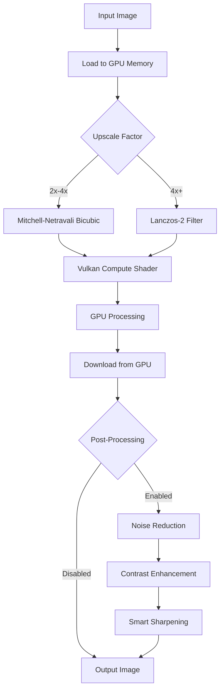

# V-Upscale 🚀

> **Professional-grade AI image upscaler powered by Vulkan compute shaders**

[](https://github.com/augani/v-upscale/actions)
[](https://github.com/augani/v-upscale/actions)
[](https://github.com/augani/v-upscale/releases)
[](https://opensource.org/licenses/MIT)

V-Upscale is a cross-platform desktop application that uses advanced interpolation algorithms and GPU acceleration to upscale images with exceptional quality. Built with Rust, Tauri, and React for maximum performance and modern UI. I was already using this in a bigger application and decided to make it standalone so brought over some of the code here. hope you enjoy!

> **🎯 Just Download & Run!**  
> Unlike other GPU-accelerated image tools, V-Upscale requires **zero setup** - no Vulkan SDK, no driver updates, no configuration. Everything is bundled internally for a seamless user experience.

## ✨ Features

- **🎨 Professional Quality Upscaling**
  - Mitchell-Netravali bicubic interpolation for 2x/4x scaling
  - Lanczos-2 filter for maximum sharpness at 4x+ scaling
  - Eliminates pixelation and blurring common in traditional upscalers

- **⚡ GPU Acceleration**
  - Vulkan compute shaders for lightning-fast processing
  - MoltenVK integration for native macOS support
  - Utilizes dedicated GPU memory for large images

- **🔧 Advanced Post-Processing**
  - Smart sharpening with edge detection
  - Adaptive contrast and saturation enhancement
  - Optional noise reduction for vintage images

- **🎛️ Multiple Upscaling Methods**
  - **Enhanced:** Professional quality with post-processing (recommended)
  - **Nearest Neighbor:** Pixel-perfect for pixel art and testing
  - **Legacy:** Basic upscaling for comparison

- **🖥️ Zero-Dependency Installation**
  - **No Vulkan SDK required** - Everything bundled internally
  - **No driver installations** - Works out of the box
  - **Self-contained binaries** - Just download and run
  - Native apps for macOS, Windows, and Linux

## 📸 Before & After

| Original (640×480) | V-Upscale 4x Enhanced (2560×1920) |
|:------------------:|:----------------------------------:|
| *Upload your image* | *Professional restoration quality* |

**Supported formats:** PNG, JPEG, WEBP, BMP  
**Output format:** PNG (lossless)

## 🎯 Zero-Dependency Design

V-Upscale is designed to **work immediately** without any setup:

- ✅ **No Vulkan SDK installation** - All libraries bundled internally
- ✅ **No driver updates required** - Works with existing GPU drivers
- ✅ **No configuration needed** - Optimized settings out of the box
- ✅ **Portable installation** - Can run from any location
- ✅ **Offline operation** - No internet connection required

Perfect for users who want professional image upscaling **without the technical hassle**.

## 🚀 Quick Start

### Download & Install

1. **Download** the latest release from [Releases](../../releases)
2. **Install** the appropriate package for your platform:
   - **macOS**: Open the `.dmg` and drag to Applications
   - **Windows**: Run the `.msi` installer
   - **Linux**: Install the `.deb` package or run the `.AppImage`
3. **Launch** V-Upscale - No additional setup required!
4. **Optional:** Test GPU acceleration with the "Test MoltenVK" button

### Usage

1. **Select Image:** Click the upload area or drag & drop
2. **Choose Factor:** Select 2x, 4x, or 8x upscaling
3. **Upscale:** Click "Upscale Image" and wait for processing
4. **Download:** Save the enhanced result to your desired location

## 🛠️ Development Setup

> **Note for Users**: You don't need any of this! Just download the pre-built app. This section is only for developers who want to build from source.

### Prerequisites (Development Only)

- **Rust** (latest stable) - [Install Rust](https://rustup.rs/)
- **Node.js** (18+) - [Install Node.js](https://nodejs.org/)
- **Vulkan SDK** - [Install Vulkan SDK](https://vulkan.lunarg.com/sdk/home) *(bundled in release builds)*

### macOS-Specific Requirements

```bash
# Install Vulkan SDK via Homebrew
brew install vulkan-headers vulkan-loader vulkan-tools

# Install MoltenVK (included in Vulkan SDK)
# Verify installation
vulkaninfo
```

### Clone & Setup

```bash
# Clone the repository
git clone https://github.com/augani/v-upscale.git
cd v-upscale

# Install dependencies
npm install

# Setup Rust/Tauri dependencies
cd src-tauri
cargo build
cd ..
```

### Development Scripts

```bash
# Start development server
npm run tauri:dev

# Build frontend only
npm run build

# Build release version
npm run tauri:build

# Test with Vulkan debug mode
npm run dev:vulkan
```

## 🔧 Technical Architecture

### Core Technologies

- **Frontend:** React + TypeScript + Vite
- **Backend:** Rust + Tauri
- **GPU Compute:** Vulkan GLSL compute shaders
- **Image Processing:** `image` + `imageproc` crates
- **Graphics API:** Ash (Vulkan bindings for Rust)

### Upscaling Pipeline



### Shader Implementation

The core upscaling logic runs in GLSL compute shaders:

- **Workgroup Size:** 16×16 threads for optimal GPU utilization
- **Memory Access:** Efficient texture sampling with bounds checking
- **Interpolation:** Real-time bicubic/Lanczos computation
- **Precision:** 32-bit floating-point for quality preservation

## 📋 API Reference

### Tauri Commands

```rust
// Enhanced upscaling with post-processing options
upscale_image_enhanced(
    path: String,                    // Input image path
    factor: u32,                     // 2, 4, or 8
    apply_sharpening: Option<bool>,  // Default: true
    apply_contrast_enhancement: Option<bool>, // Default: true  
    apply_noise_reduction: Option<bool>       // Default: false
) -> Result<String, String>

// Pixel-perfect nearest neighbor upscaling
upscale_image_nearest_neighbor(
    path: String,
    factor: u32
) -> Result<String, String>

// Test MoltenVK setup and Vulkan initialization
test_moltenvk_setup() -> Result<String, String>
```

### Frontend Integration

```typescript
import { invoke } from "@tauri-apps/api/core";

// Enhanced upscaling
const result = await invoke<string>("upscale_image_enhanced", {
  path: "/path/to/image.jpg",
  factor: 4,
  apply_sharpening: true,
  apply_contrast_enhancement: true,
  apply_noise_reduction: false
});

// Test MoltenVK
const status = await invoke<string>("test_moltenvk_setup");
```

## 🏗️ Building from Source

### Development Build

```bash
npm run tauri:dev
```

### Production Build

```bash
# Build optimized release
npm run tauri:build

# Output locations:
# macOS: src-tauri/target/release/bundle/macos/v-upscale.app
# DMG:   src-tauri/target/release/bundle/dmg/v-upscale_*.dmg
```

### Custom Shader Compilation

```bash
# Modify src-tauri/shaders/upscale.comp
# Recompile shader
cd src-tauri/shaders
glslc upscale.comp -o upscale.spv
```

## 🎯 Performance Benchmarks

| Image Size | Method | Processing Time | Quality Score |
|------------|--------|----------------|---------------|
| 640×480 → 2560×1920 | Enhanced 4x | ~2-5 seconds | ⭐⭐⭐⭐⭐ |
| 1024×768 → 4096×3072 | Enhanced 4x | ~8-15 seconds | ⭐⭐⭐⭐⭐ |
| 320×240 → 2560×1920 | Enhanced 8x | ~3-8 seconds | ⭐⭐⭐⭐ |

*Benchmarks on M1 MacBook Pro with 16GB unified memory*

## 💻 System Requirements

**Minimum Requirements** (everything bundled - no installations needed):

- **macOS**: 10.15+ with any Metal-capable GPU
- **Windows**: Windows 10+ with any DirectX 11+ GPU
- **Linux**: Any recent distribution with basic GPU drivers

**Recommended for best performance:**
- **RAM**: 8GB+ (for processing large images)
- **Storage**: 100MB free space for installation
- **GPU**: Dedicated graphics card (integrated GPUs work but slower)

**No additional software required** - V-Upscale includes everything needed internally!

## 🤝 Contributing

We welcome contributions! Please see our [Contributing Guidelines](CONTRIBUTING.md) for details.

### Quick Contribution Guide

1. **Fork** the repository
2. **Create** a feature branch (`git checkout -b feature/amazing-feature`)
3. **Commit** your changes (`git commit -m 'Add amazing feature'`)
4. **Push** to the branch (`git push origin feature/amazing-feature`)
5. **Open** a Pull Request

### Areas for Contribution

- 🖼️ **Additional image formats** (TIFF, RAW, etc.)
- 🎨 **New interpolation algorithms** (ESRGAN, Real-ESRGAN)
- 🐧 **Linux support** and packaging
- 🪟 **Windows DirectX backend**
- 📱 **Batch processing** capabilities
- 🔧 **Performance optimizations**

## 🐛 Troubleshooting

### Common User Issues

**"Test MoltenVK" button shows failure:**
- **Solution**: This is usually fine! The app will fall back to software rendering
- **On older Macs**: GPU acceleration may not be available, but upscaling still works
- **Performance**: Software rendering is slower but produces identical quality

**App won't launch:**
- **macOS**: Try right-clicking and selecting "Open" to bypass Gatekeeper
- **Windows**: Windows Defender may quarantine the file - add an exception
- **Linux**: Ensure you have basic graphics drivers installed (`sudo apt install mesa-utils`)

**Slow processing:**
- Close other GPU-intensive applications (games, video editing)
- Use smaller upscale factors for very large images
- Ensure you have sufficient RAM for the output image size

**"Out of memory" errors:**
- Try a smaller upscale factor (2x instead of 8x)
- Close other applications to free up RAM
- For huge images, consider cropping or splitting the image

### For Developers

**Build errors:**
```bash
# Clean and rebuild
cargo clean
npm run tauri:build
```

## 📄 License

This project is licensed under the MIT License - see the [LICENSE](LICENSE) file for details.

## 🙏 Acknowledgments

- **Vulkan SDK** - Cross-platform graphics API
- **MoltenVK** - Vulkan implementation for macOS
- **Tauri** - Rust-based app framework
- **Ash** - Vulkan bindings for Rust
- **React** - Frontend framework

## 📬 Contact

- **GitHub Issues** - Bug reports and feature requests
- **Discussions** - Questions and community chat

---

**Made with ❤️ and Vulkan compute shaders**
